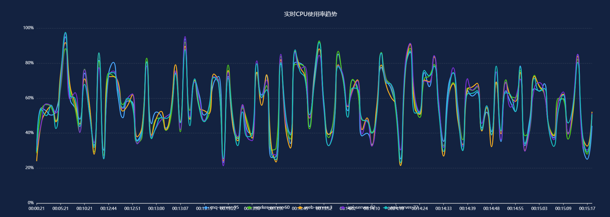
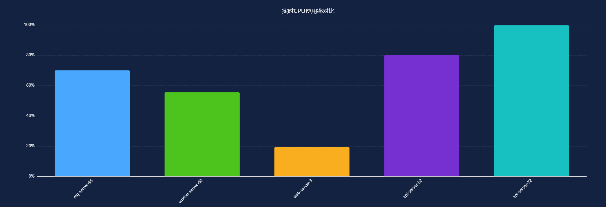
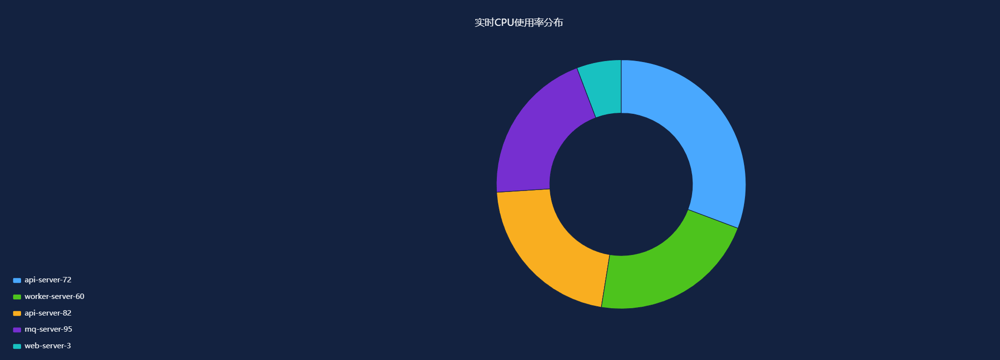
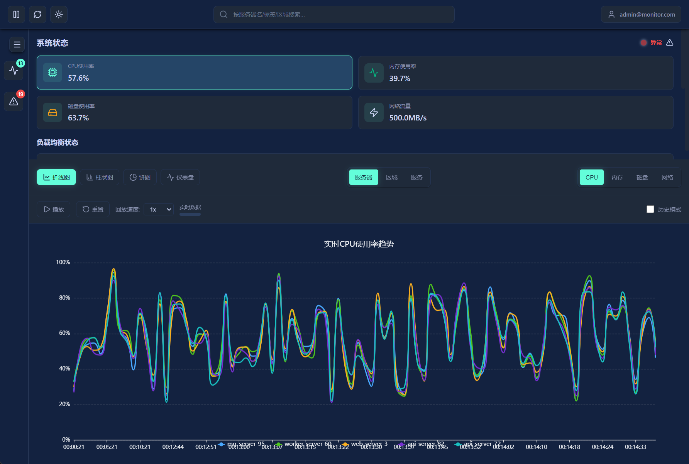
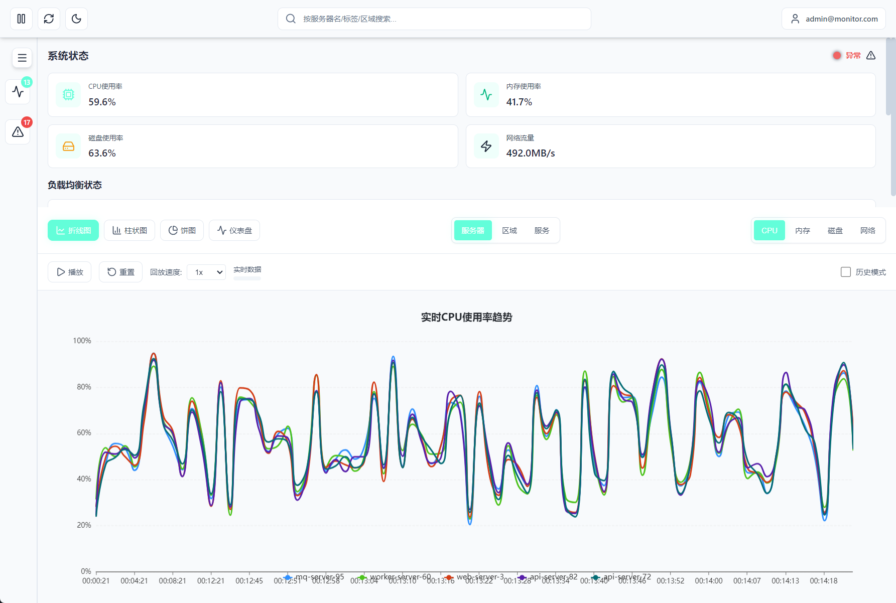
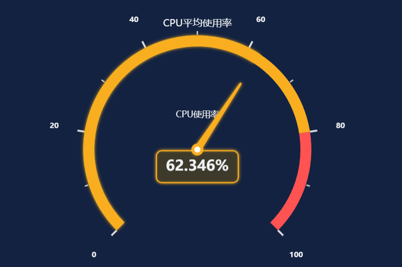

# 系统监控Web面板 - AI Coding工具交互过程日志

## 项目概述
本项目是一个基于React + ECharts的系统监控Web面板，实现了实时数据展示、主题切换、响应式布局等功能。本日志记录了与AI Coding工具（GLM4.6）的关键交互过程，便于追溯开发历程。

## 交互过程记录表

| 交互时间          | AI工具名称 | 交互阶段         | 核心交互内容（需具体到操作）| 关联素材（截图文件名） | 操作结果/备注                     |
|-------------------|------------|------------------|------------------------------------------------------------------|------------------------|-----------------------------------|
| 2025-12-18 20:31  | GLM4.6     | 项目初始化阶段   | 提交系统监控Web面板需求，AI输出项目结构和技术选型建议 | 01-项目初始化-需求分析.png | 确认使用React + ECharts + Zustand技术栈 |
| 2025-12-18 20:42  | GLM4.6     | 布局开发阶段     | 提交布局需求，AI输出响应式顶部+侧边栏+右侧分区的React代码 | 02-布局开发-代码输出.png | 代码集成后，布局结构正常 |
| 2025-12-18 21:03  | GLM4.6     | 数据流管理阶段   | 提交实时数据更新需求，AI实现Zustand状态管理和数据流控制 | 03-数据流管理-状态管理.png | 实现了数据过滤、暂停/恢复功能 |
| 2025-12-18 21:18  | GLM4.6     | 图表开发阶段     | 提交图表需求，AI输出折线图、柱状图、饼图和仪表盘的ECharts配置 | 04-图表开发-ECharts配置.png | 完成四种图表类型的基础实现 |
| 2025-12-18 22:05  | GLM4.6     | 深色主题优化阶段 | 提交深色模式下图表对比度问题，AI优化图表颜色配置 | 05-深色主题-颜色优化.png | 深色模式下图表辨识度提升 |
| 2025-12-18 22:15  | GLM4.6     | 主题切换阶段     | 提交主题切换需求，AI实现浅色/深色主题动态切换功能 | 06-主题切换-功能实现.png | 完成主题状态管理和样式适配 |
| 2025-12-18 22:32  | GLM4.6     | 浅色主题优化阶段 | 提交浅色模式图表显示问题，AI优化文本颜色和对比度 | 07-浅色主题-样式优化.png | 浅色模式下图表元素对比度达标 |
| 2025-12-18 22:44  | GLM4.6     | 布局问题修复阶段 | 提交折叠状态下图标重叠问题，AI调整CSS布局 | 08-布局修复-重叠问题.png | 修复折叠状态下图标与按钮重叠 |
| 2025-12-18 23:01  | GLM4.6     | 数据精度优化阶段 | 提交仪表盘数据精度需求，AI实现CPU使用率保留三位小数 | 09-数据精度-格式化.png | 仪表盘CPU使用率显示精度提升 |
|                   |            |                  |                                                                  |                        |                                   |
|                   |            |                  |                                                                  |                        |                                   |
|                   |            |                  |                                                                  |                        |                                   |
|                   |            |                  |                                                                  |                        |                                   |
|                   |            |                  |                                                                  |                        |                                   |

## 交互阶段说明

### 1. 项目初始化阶段
- **目标**：确定项目技术栈和基本架构
- **关键输出**：项目结构、依赖包选择、开发环境配置
- **成果**：确立React + ECharts + Zustand + CSS Modules技术栈

### 2. 布局开发阶段
- **目标**：实现响应式布局结构
- **关键输出**：顶部控制台、侧边栏、右侧内容区域的组件代码
- **成果**：完成基础布局，支持桌面/平板/移动端适配

### 3. 数据流管理阶段
- **目标**：实现实时数据更新和状态管理
- **关键输出**：数据过滤、暂停/恢复、刷新功能
- **成果**：建立完整的数据流控制机制

### 4. 图表开发阶段
- **目标**：实现多种图表类型的数据可视化
- **关键输出**：折线图、柱状图、饼图、仪表盘的ECharts配置
- **成果**：完成四种图表类型的基础实现

### 5. 深色主题优化阶段
- **目标**：优化深色模式下图表的显示效果
- **关键输出**：高对比度颜色配置、深色背景适配
- **成果**：提升深色模式下图表的可读性

### 6. 主题切换阶段
- **目标**：实现浅色/深色主题动态切换
- **关键输出**：主题状态管理、样式动态适配
- **成果**：完成主题切换功能，支持实时切换

### 7. 浅色主题优化阶段
- **目标**：优化浅色模式下图表的显示效果
- **关键输出**：文本颜色优化、对比度提升
- **成果**：浅色模式下图表元素对比度达标

### 8. 布局问题修复阶段
- **目标**：解决折叠状态下的布局问题
- **关键输出**：CSS布局调整、元素定位优化
- **成果**：修复折叠状态下图标与按钮重叠问题

### 9. 数据精度优化阶段
- **目标**：优化数据展示精度
- **关键输出**：数据格式化函数、精度控制
- **成果**：仪表盘CPU使用率显示保留三位小数

## 使用说明

1. **填写要求**：
   - 每次与AI工具进行关键交互后，及时填写本表格
   - 交互时间精确到分钟
   - 核心交互内容需具体到操作细节
   - 关联素材列填写截图完整文件名

2. **截图管理**：
   - 按照截图管理规则进行命名和存储
   - 确保截图与日志记录一一对应
   - 截图应清晰展示关键交互内容

3. **更新频率**：
   - 建议每个交互阶段结束后立即更新
   - 项目里程碑节点必须记录
   - 重要问题解决过程需详细记录

## 注意事项

- 本日志应与项目代码同步更新
- 截图文件路径变更时需同步更新日志
- 定期备份日志文件和截图素材
- 项目交付时需包含完整的交互日志